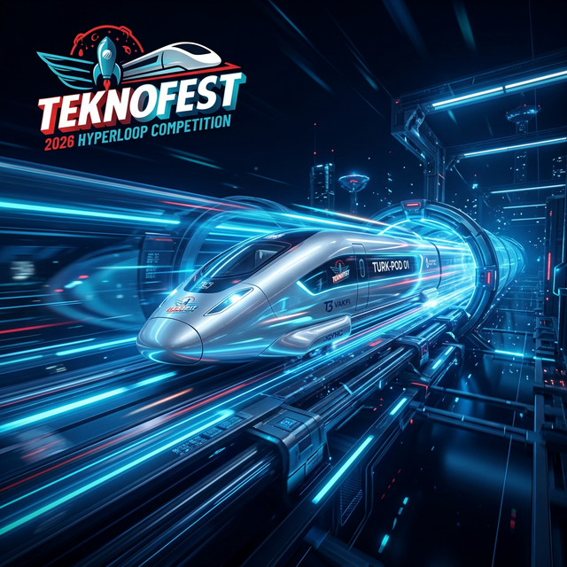

<p align="center">
  
</p>

<div align="center">

```text
██╗  ██╗██╗   ██╗██████╗ ███████╗██████╗ ██╗      ██████╗  ██████╗ ██████╗ 
██║  ██║╚██╗ ██╔╝██╔══██╗██╔════╝██╔══██╗██║     ██╔═══██╗██╔═══██╗██╔══██╗
███████║ ╚████╔╝ ██████╔╝█████╗  ██████╔╝██║     ██║   ██║██║   ██║██████╔╝
██╔══██║  ╚██╔╝  ██╔═══╝ ██╔══╝  ██╔══██╗██║     ██║   ██║██║   ██║██╔═══╝ 
██║  ██║   ██║   ██║     ███████╗██║  ██║███████╗╚██████╔╝╚██████╔╝██║     
╚═╝  ╚═╝   ╚═╝   ╚═╝     ╚══════╝╚═╝  ╚═╝╚══════╝ ╚═════╝  ╚═════╝ ╚═╝     
                                                            v5.0.0-PROTOTYPE
```


**"Sınırları Zorlayan Hız, Akılla Birleşen Güvenlik ve Of, Trabzon'un Mühendislik Ruhuyla Geleceği Tasarlayan Milli Hamle."**

</div>

---

## 🗺️ Görev Özeti (Mission Brief: Detailed Vision)

**Hyperloop Geliştirme Projesi**, sadece bir ulaşım aracı prototipi değil, ulaşımın 5. boyutu olarak adlandırılan vakumlu tüp taşımacılığının Türkiye'deki öncü mühendislik temellerini oluşturmayı hedefler. **Trabzon'un Of ilçesinden** yola çıkan ve Karadeniz'in azmiyle yoğrulan ekibimiz tarafından geliştirilen bu repository, **Teknofest 2026 Hyperloop Geliştirme Yarışması** gereksinimlerine göre sıfırdan kurgulanan *HyperSystem* podunun dijital omurgasını temsil eder. Yazılım mimarimiz, tünel içerisindeki aşırı düşük sürtünme ortamında podun dinamiğini yönetmek, manyetik askılama kararlılığını sağlamak ve milisaniyelik gecikmelerin dahi kritik olduğu yüksek hızlı otonom sürüş senaryolarını simüle etmek üzere dizayn edilmiştir.

2026 yılının 5. edisyonu, yarışmayı sadece bir hız parkuru olmaktan çıkarıp; derinlemesine uzmanlık gerektiren **TRL (Teknoloji Hazırlık Seviyesi)** odaklı bir platforma dönüştürmüştür. Podumuzun kontrol yazılımı, 208 metrelik tünel içerisindeki her bir atomik hareketi, sensör füzyonu (sensor fusion) algoritmaları ve gerçek zamanlı (real-time) veri işleme kapasitesiyle takip ederek; hem performans hem de güvenlik alanında küresel standartları (IEC 61508, EN 50126) referans alan bir güvenilirlik sunar. Bu proje, "Milli Teknoloji Hamlesi" vizyonuyla, akademik birikimi endüstriyel bir prototipe dönüştürmenin en somut adımıdır.

---

## 🏎️ Yarışma Kategorileri (In-Depth Domain Breakdown)

Podumuz, 2026 Şartnamesi'nde (Bölüm 2, 3 ve 4) tanımlanan üç kritik geliştirme alanında tam kapsamlı bir mühendislik yanıtı sunmaktadır:

### 1. Performans Kategorisi (Precision & Efficiency)
Performans, sadece nihai hız değil, itki ve levitasyon sistemlerinin tükettiği her bir watt enerjinin en verimli şekilde kinetik enerjiye dönüştürülmesidir. 186 metrelik aktif yarış parkurunda, podun ivmelenme profilini optimize eden algoritmalarımız, tünel sonundaki darbe sönümleyici bariyerlere (Section 2.c) yaklaşmadan önce güvenli duruş mesafesini korurken, aynı zamanda pürüzsüz bir seyahat kalitesi için manyetik hava aralığı sapmalarını minimize eder.

### 2. Teknoloji Gösterim Kategorisi (Strategic Core Tech)
Bu kategori, Hyperloop teknolojisinin "çekirdek" bileşenlerinde derinleşmeyi hedefler. Mühendislik kaynaklarımızı özellikle **Manyetik Levitasyon** ve **Lineer İndüksiyon Motoru (LIM)** alanlarında yoğunlaştırarak, fiziksel tekerlek temasını tamamen ortadan kaldıran, aşınmasız ve yüksek hızlı ulaşım modelleri geliştirdik. Çelik raylar üzerinde (Bölüm 3.3.b) gerçekleştirilen levitasyon gösterimlerimiz, enerji verimliliği açısından alüminyum sistemlere göre daha üstün bir profil çizerken, otonom kontrol döngülerimiz sınıra yakın durumlarda (edge cases) dahi sistem kararlılığını korur.

### 3. Tanımlı Problem Çözümü: AKGYS (Intelligent Autonomy)
2026 yılına özgü "Tanımlı Problem", Hyperloop sistemlerinin gelecekteki operasyonel güvenliğini temsil eder. **Akıllı Kapsül Güvenlik Yönetim Sistemi (AKGYS)**, podun içerisinde bir "süpervizör" gibi çalışarak; dekompresyon (basınç kaybı), batarya termal kaçakları (thermal runaway) veya yapısal titreşim anomallerini tespit eder. Bu sistem, yer istasyonuna (Section 5.2.5) bağımlı kalmaksızın, podun otonom olarak "GÜVENLİ DURUŞ" moduna geçmesini sağlayacak karar ağaçlarını ve risk analiz motorunu (FMEA/FTA) bünyesinde barındırır.

---

## ⚡ 2026 Teknik Şartname El Kitabı (Master Specifications)

### 📏 Tünel Geometrisi ve Fiziksel Sınırlar (Section 2)
Test tüneli, 208 metre toplam uzunluğa sahip, iç çapı 1148 mm olan devasa bir çelik yapıdır. Podumuzun aerodinamik tasarımı, tünel iç yüzeyinin koyu rengi (Section 2.e) ve tünel betonuna monte edilmiş Alüminyum 6101-T6 (Alt Ray) / 6061-T6 (Kılavuz Ray) bileşenlerine göre optimize edilmiştir. 186 metrelik yarış parkuru boyunca, podun her 4 metrede bir karşılaştığı reflektör şeritleri (Section 7.b), navigasyon sistemimizin ana "mihenk taşlarını" oluşturur.

### 🛠️ Kapsül Mekanik ve Dinamik İsterleri (Section 3)
Podumuz, 2026'nın zorlayıcı **250 kg** kütle limitini (Section 3.c) karşılamak için yüksek mukavemetli alüminyum alaşımları ve karbon fiber kompozitlerden üretilmiştir. Uzunluğu 3500 mm limitine kadar optimize edilebilen yapımızda, tüm bağlantı elemanları DIN/EN/ISO standartlarına (Section 3.l) uygun olarak kendinden kilitlemeli (nyloc) ve torklanmış marka işaretli olarak kurgulanmıştır. Podun arka kısmındaki kurtarma bağlantısı, 10mm diş derinliğiyle (Section 3.1.d), acil durumlarda podun tüm fren kuvvetinin 2 katına dayanacak şekilde şasiye kilitlenmiştir.

### 🛑 Frenleme Protokolleri ve Fail-Safe Mimari (Section 4)
Güvenliğimiz, "Tek Hata Toleransı" (Single Fault Tolerant) prensibi üzerine kuruludur. İki bağımsız fren mekanizması (Section 4.b), herhangi bir bileşen arızasında dahi podu emniyetli bir mesafe içerisinde durdurabilir. Yazılımımız, sistemde güç kaybı veya kritik bir sensör hatası tespit ettiğinde (Fail-Safe Mode), yay baskılı pnömatik frenleri 0.5 saniyenin altında (Section 4.k) aktif ederek podu tünel bariyerlerinden önce durdurur. Görsel ikaz sistemi (Section 4.l), frenlerin durumunu uzak mesafelerden dahi doğrulanabilir kılar.

### 📡 Telemetri Yayını ve AEM Konfigürasyonu (Section 5)
Haberleşme omurgamız, organizasyon tarafından sağlanan Ağ Erişim Modülü (AEM) ile entegredir. 20 Mbps bant genişliği ve <10ms gecikme süresiyle çalışan sistemimiz, DB9 konnektörü (Pin 9: Power, Pin 5: Ground) üzerinden 12-36V besleme alır. Her 1 saniyede bir yayınlanan 1Hz telemetri paketleri (Section 5.2.5.c); podun X-Y-Z kartezyen koordinatlarını, Pitch-Roll-Yaw oryantasyonunu, batarya hücresi başına düşen sıcaklık verilerini ve AKGYS'den gelen anlık risk öncelik numarasını (RPN) yer istasyonuna iletir.

---

## 🛡️ AKGYS: Akıllı Güvenlik ve Risk Yönetimi (Bölüm 4)

AKGYS, podun otonom güvenlik bilincidir. 2026 Tanımlı Problem Çözümü kapsamında geliştirilen bu motor, sensör füzyonu verilerini kullanarak Monte Carlo simülasyonlarıyla doğrulanmış bir risk analizi yürütür:

| Değişken | İzleme Yöntemi | Güvenlik Eşiği | AKGYS Aksiyonu |
| :--- | :--- | :--- | :--- |
| **Atmosferik Basınç** | Diferansiyel Barometre | 0.5 Bar (Ani Kayıp) | AUTO_EMERGENCY_STOP < 5s |
| **Batarya Termal** | 10 Hücrede 1 Sensör | > 55°C (Kritik) | İtki Kesme + Thermal Guard |
| **Navigasyon Sapması** | Reflektör vs. Encoder | > %5 Sapma Payı | Redundant Sensör Seçimi |

**Risk Öncelik Sayısı (RPN) Mantığı:**
Podun `akgys.py` modülü, her modülden gelen anomali puanlarını `Şiddet x Olasılık x Tespit` çarpanlarıyla işler. `RPN > 50` olduğunda pod, yer istasyonundan komut beklemeden frenleri kilitler ve yolcu bilgilendirme sistemlerini (Bölüm 4.3.c.vi) "Tahliye Modu"na geçirir.

---

## 🧠 Yazılım ve Kontrol Mimari (Software Internals)

### Modüler Kontrol Döngüsü
Yazılımımız, asenkron çalışan ve birbirini denetleyen bağımsız modüllerden oluşur. Bu yapı, kodun test edilebilirliğini ve yarışma anındaki müdahale hızını maksimize eder:

1.  **Levitation Modülü:** PID kontrol döngüsü, 10.0mm hedef hava aralığını korurken, ray üzerindeki bozucu etkileri (disturbance rejection) sönümler.
2.  **Navigation Modülü:** Reflektör sayma algoritması, tünelin son 100m ve 48m bölgelerindeki (Section 7.f/g) yüksek frekanslı şeritleri algılayarak dinamik frenleme haritasını günceller.
3.  **Safety Modülü:** Batarya Yönetim Sistemi (BMS), her hücrenin gerilim ve sıcaklığını 80dB şiddetindeki buzzer/flaşör sistemiyle (Section 8.i) senkronize izler.

---

## � Küresel Rekabet ve Stratejik Analiz (Competitor Analysis)

Projemiz, dünya genelindeki Hyperloop ekosistemiyle teknik olarak kıyaslanabilir ve birçok noktada özgün çözümler sunmaktadır:

- **Dünyadaki Benzerleri:** European Hyperloop Week (EHW), Global Hyperloop Competition (IIT Madras) ve SpaceX (Eski) gibi dev organizasyonlar, projemizin teknik standartlarını belirleyen ana referanslardır.
- **Yazılım Referansları:** Delft Hyperloop'un *Serpenta* GUI mimarisi ve TUM Hyperloop'un düşük gecikmeli haberleşme protokolleri, kontrol yazılımımızın modüler yapısında (özellikle `telemetry.py` ve `main_brain.py`) benchmark olarak kullanılmıştır.
- **Stratejik Farkımız:** Rakipler genelde genel güvenlik (fail-safe) protokollerine odaklanırken, bizim **Of/Trabzon** ruhuyla geliştirdiğimiz **AKGYS (Otonom Karar Mekanizması)**, podun anlık riskleri (RPN) hesaplayıp yer istasyonuna ihtiyaç duymadan duruş kararı almasını sağlayarak bizi 2026'da "Tanımlı Problem" çözümünde öne çıkarmaktadır.

---

## �🚀 Kurulum, Simülasyon ve Deploy (User Manual)

### Geliştirici Gereksinimleri
- **Python:** 3.9 veya 3.10 (Stabilite için önerilir)
- **Kütüphaneler:** Terminal üzerinde `pip install numpy matplotlib` komutlarıyla simülasyon araçlarını kurabilirsiniz.

### Hızlı Görev Başlatma (Quick Start)
```bash
# Depoyu yerel makinenize çekin
git clone https://github.com/bahattinyunus/teknofest_hyperloop.git
cd teknofest_hyperloop

# Simülasyon ortamını hazırlayın
pip install -r requirements.txt

# TEKNOFEST 2026 Simülasyonunu Ateşleyin
python src/core/main_brain.py
```

---

## 📅 Gelecek Planları ve Yol Haritası (Roadmap)
- [ ] **GUIdashboard:** 2026 AEM standartlarına uyumlu, gerçek zamanlı web-tabanlı telemetri arayüzü.
- [ ] **Hardware Synchronization:** Yazılımın, fiziksel STM32 veya ESP32 kontrolcüleri ile Hardware-in-the-Loop (HIL) modunda çalıştırılması.
- [ ] **Advanced AI Diagnostics:** Anomali tespiti için kural tabanlı algoritmaların yerine, LSTM tabanlı yapay zeka modellerinin entegrasyonu.

---
<div align="center">
    
    <br>
    <i>"Gelecek, Of'un azmi ve Türk Gençliğinin ellerinde hızlanarak geliyor."</i><br>
    <b>TEKNOFEST 2026 HYPERLOOP TEAM - OF/TRABZON</b>
</div>
