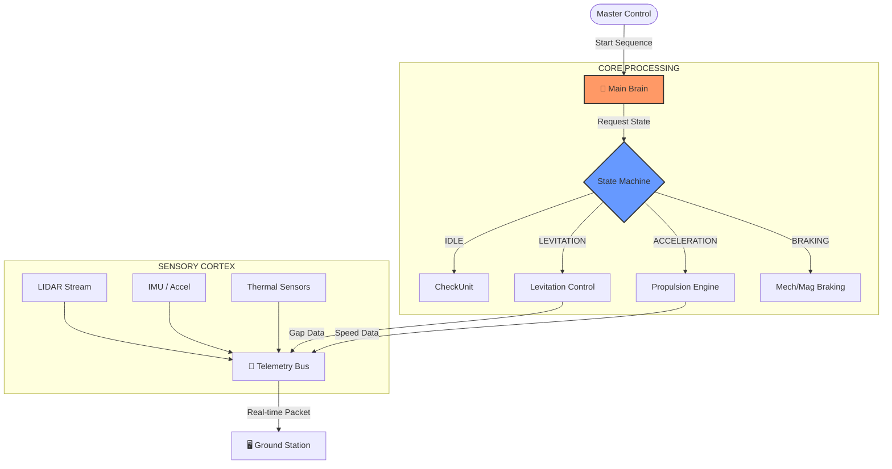

<div align="center">

```text
██╗  ██╗██╗   ██╗██████╗ ███████╗██████╗ ██╗      ██████╗  ██████╗ ██████╗ 
██║  ██║╚██╗ ██╔╝██╔══██╗██╔════╝██╔══██╗██║     ██╔═══██╗██╔═══██╗██╔══██╗
███████║ ╚████╔╝ ██████╔╝█████╗  ██████╔╝██║     ██║   ██║██║   ██║██████╔╝
██╔══██║  ╚██╔╝  ██╔═══╝ ██╔══╝  ██╔══██╗██║     ██║   ██║██║   ██║██╔═══╝ 
██║  ██║   ██║   ██║     ███████╗██║  ██║███████╗╚██████╔╝╚██████╔╝██║     
╚═╝  ╚═╝   ╚═╝   ╚═╝     ╚══════╝╚═╝  ╚═╝╚══════╝ ╚═════╝  ╚═════╝ ╚═╝     
                                                            v4.0.0-PROTOTYPE
```


**"Hız, Kontrol, Gelecek."**

</div>

---

## �️ Görev Özeti (Mission Brief)

**Hyperloop**, sadece bir ulaşım projesi değil, bir mühendislik meydan okumasıdır. Bu repo, **Teknofest Hyperloop Geliştirme Yarışması** için tasarlanan *HyperSystem* podunun dijital ikizini ve kontrol mimarisini barındırır. Amaç, ses hızına yakın hızlarda seyredecek bir podun elektromanyetik, mekanik ve yazılımsal entegrasyonunu kusursuz bir şekilde simüle etmek ve yönetmektir.

> [!NOTE]
> Bu bir **Command Center** reposudur. Kodlar, sadece fonksiyonel değil, aynı zamanda sistemin hayatta kalma (survival) protokolleridir.

## 🧠 Bilişsel Mimari (Cognitive Architecture)

Podumuz, merkezi bir "Brain" tarafından yönetilen otonom bir varlıktır. Aşağıdaki diyagram, sistemin düşünce yapısını özetler.



## ⚡ Teknik Spesifikasyonlar (Technical Specs)

### 1. Levitation (Manyetik Askılama)
Sistemimiz, hava boşluğunu (air gap) mikron seviyesinde kontrol etmek için **PID (Proportional-Integral-Derivative)** algoritmaları kullanır.

- **Teknoloji**: EMS (Electro-Magnetic Suspension) / EDS (Electro-Dynamic Suspension) Hibrit Modeli.
- **Kontrol Döngüsü**: 1000Hz.
- **Hedef Gap**: 8mm - 12mm.

### 2. Propulsion (İtki Sistemi)
Doğrusal İndüksiyon Motoru (LIM) simülasyonu, slip (kayma) ve kuvvet vektörlerini hesaplar.

- **Max Thrust**: 5000N.
- **Max Hız**: 1200 km/h (Teorik).
- **Soğutma**: Aktif sıvı soğutma telemetrisi entegre.

### 3. Telemetry (Telemetri ve Haberleşme)
Pod, Yer İstasyonu ile TCP/UDP üzerinden *Heartbeat* paketleri göndererek sürekli iletişimde kalır.

- **Packet Structure**: `Header | Timestamp | State | SensorData | CRC`
- **Latency**: < 20ms.

## �️ Kurulum ve Başlatma (Deployment)

Bu komuta merkezini yerel makinenizde ayağa kaldırmak için:

1. **Repoyu Klonla**:
   ```bash
   git clone https://github.com/bahattinyunus/teknofest_hyperloop.git
   cd teknofest_hyperloop
   ```

2. **Sanal Ortam ve Bağımlılıklar**:
   ```bash
   python -m venv venv
   .\venv\Scripts\activate
   pip install -r requirements.txt # (Yakında eklenecek)
   ```

3. **Simülasyonu Başlat**:
   ```bash
   python src/core/main_brain.py
   ```

## �️ Yol Haritası (Roadmap)

- [x] **Project Initialization**: Dizin yapısı ve temeller.
- [ ] **Levitation Module**: PID kontrolcüsü ve fizik motoru.
- [ ] **Propulsion Module**: İtki ve sürtünme simülasyonu.
- [ ] **GUI Dashboard**: PyQt5 tabanlı gerçek zamanlı veri izleme.
- [ ] **Final Test**: Tam sistem entegrasyon testi.

---
<div align="center">
    <i>"Gelecek, hızlanarak gelir."</i><br>
    <b>TEKNOFEST 2025 HYPERLOOP TEAM</b>
</div>

